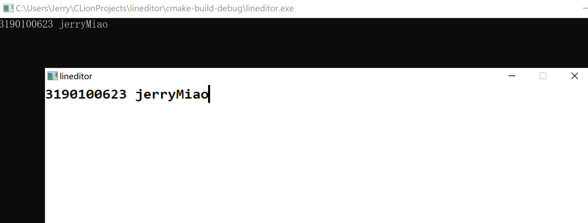
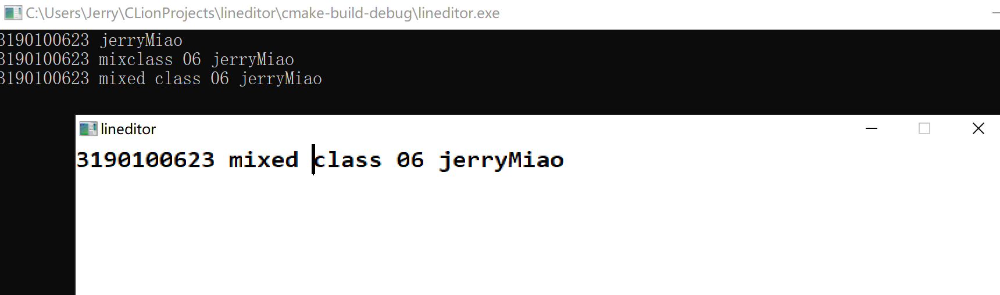
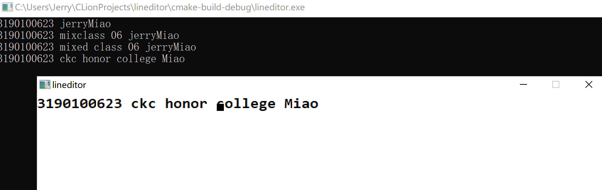
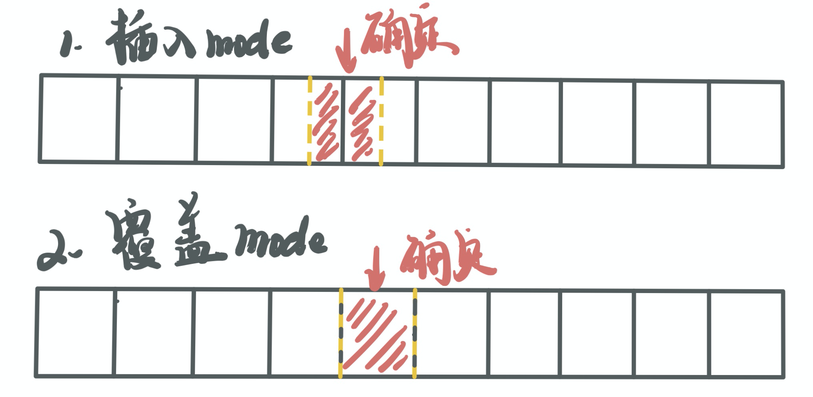
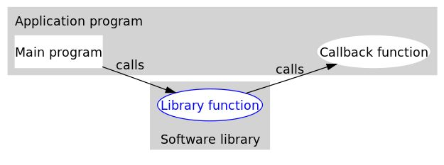

## LineEditor

### 一、实现功能

1. 实现一个GUI窗口内的单行的文本输入编辑器

2. 支持左右方向键、回退和删除键，编辑过程中有光标闪烁，插入和覆盖状态的光标形状不同

3. *支持鼠标单击定位光标

4. 两种模式【通过insert键切换】

   模式一：插入模式，在当前闪烁光标后插入文字

   模式二：覆盖模式，若光标指向位置存在文字，则覆盖；若无，则插入

5. 回车后，结束输入，将输入的内容在标准输出输出

### 二、测试效果

#### 2.1 示例1 - 插入模式





#### 2.2 示例2 - 覆盖模式



### 三、代码实现

#### 3.0 基础

运用全局变量`nowX`，`nowY = 0`储存当前指针位置，运用全局`list`储存字符串集，运用全局变量`mode`指示当前输入模式。

```c
int Setup(
{
    list = list_create();
    initWindow("lineditor",200,200,width,height);
    initConsole();

    registerMouseEvent(mouseListener);
    registerKeyboardEvent(keyListener);
    registerTimerEvent(timerListener);
    registerCharEvent(charListener);

    startTimer(0, 500);
    endPaint();
}
```

#### 3.1 储存输入的字符

在读入多项式的过程中，创建了库 ` linkedlist` ，其中编写了如下函数：

```c
List  list_create();                          //创建双向链表
Node* list_find(List *list, int x);           //寻找第x位置的前一个节点
void  list_insert(List *list, int x, char c); //在第x位置后插入
void  list_remove(List *list, int x);         //删除第x位置之前的节点
```

##### 1.数据结构

```c
typedef struct _node {
    char c[2];
    struct _node *prev;
    struct _node *next;
} Node;

typedef struct {
    Node *head;
    int length;
} List;
```

由于 `PaintText` 函数打印时需要一个字符串，故另节点内的 `payload` 部分为2个长度的字符串，前一位是字符，后一位是 `'\0'` 。储存时采用带哨兵节点的双向链表，由 `List` 封装，包含哨兵头节点以及一行字符串的长度。

##### 2.操作集

```c
List list_create() //list initialize
{
    List Temp;
    Temp.head = malloc(sizeof(Node));
    Temp.head->next = NULL;
    Temp.head->prev = NULL;
    Temp.length = 0;
    Temp.head->c[0] = ' ';
    Temp.head->c[1] = '\0';
    return Temp;
}
```

`list_create` 函数用于创建及初始化一个含哨兵节点的空双向链表。

```c
Node* list_find(List *list, int x)
{
    int cnt = 0;
    Node * temp = list->head;
    while(cnt < x){
        temp = temp->next;
        cnt++;
    }
    return temp;
}
```

在 `list_insert` 以及 `list_remove` 中都调用 `list_find` 来寻找需要操作的节点位置。其中创建 `cnt` 计数器，随链表基础循环自增，直到第 `x` 个跳出循环，返回当前节点地址。

```c
void list_insert(List *list, int x, char c)
{
    //initialize insert node
    Node* p = (Node*)malloc(sizeof(Node));
    p->c[0] = c;
    p->c[1] = '\0';
    p->next = NULL;
    p->prev = NULL;
    //find position
    Node* temp = list_find(list, x);
    //insert possess
    if(x == list->length){               //list tail
        //temp <-> p
        temp->next = p;
        p->prev = temp;
        //renew length
        list->length++;
    }else if(x < list->length && x >= 0){ //not tail
        //p <-> old
        p->next = temp->next;
        temp->next->prev = p;
        //temp <-> p
        temp->next = p;
        p->prev = temp;
        //renew length
        list->length++;
    }
}
```

在编写 `list_insert` 函数时，需要分尾和中间两种情况，对涉及到的节点相互之间建立连接，如下图所示，在代码中也做了详细的注释。虽然代码看起来较长，但逻辑清晰简明，主要是注释较多，可读性强。


```c
void list_remove(List *list, int x)
{
    //find position
    Node* temp = list_find(list, x);
    //remove process
    if(x > 0 && x <= list->length){
        temp->prev->next = temp->next;
        if(temp->next){ //not tail
            temp->next->prev = temp->prev;
        }
        free(temp);
        list->length--; //renew length
    }
}
```

在编写 `list_remove` 时，双向链表的优势发挥得比较明显，可以轻松的确定前后项，完成删除操作，逻辑如下图所示。


#### 3.2 绘制光标

##### 1. 绘制光标和文字

```c
void PrintPointer(void)
{
    beginPaint();
    clearDevice(); //清空画布
    endPaint();

    PrintText();   //用于将双向链表中的文字输出到gui中

    beginPaint();
    if(mode == 0){ //插入模式光标样式
        setPenWidth(3);
        line(calX(nowX), calY(nowY), calX(nowX), calY(nowY)+charheight);
    }else{         //覆盖模式光标样式
        rectangle(calX(nowX)+2, charheight-10, calX(nowX)+charwidth-2, charheight-2);
    }
    endPaint();
}
```

在程序中，各个回调函数结束后，都需调用 PrintPointer 来刷新内容，同时，控制闪烁过程中也需要使用。

##### 2. 实现闪烁光标

```c
void timerListener(int id)
{
    static int flag = 0;
    if(id == 0){flag = 1 - flag;} //当计时器报数时，反转状态
	if(flag == 1){       //打印光标+文字
        PrintPointer();
    }
    if(flag == 0){       //打印文字
        beginPaint();
        clearDevice();
        endPaint();
        PrintText();
    }
    //printf("%d %d\n",id, flag);
}
```

很不幸，一开始没找到 `showCaret` 之类的函数来实现光标的绘制。然后，我觉得用 `timeListener` 来实现也挺方便的。

首先，在 `Setup` 中使用语句 `startTimer(0, 500);` 来开启 `id ` 为 `0` 的定时器。在 `timeListener` 中定义一个静态本地变量 `flag` 来标志目前的光标状态（亮/灭）。两种状态分别对应触发：（清空后）打印光标+文字、（清空后）打印文字，则可以实现，周期为$1000ms$的闪烁光标。

#### 3.3 键盘功能实现

##### 1. 左右、ins、backspace、enter、delete功能键的实现

在回调函数 `keyListener` 中，当 `event == 0` 时，进行`switch (key)`

```c
case 8: //backspace
    if(nowX > 0){
        list_remove(&list, nowX);
        nowX--;
    }
    PrintPointer();
    break;
```

**backspace功能：**删除光标前一个字符

```c
case 13: //enter
    PrintTOConsole();
    break;
```

**enter功能：**将gui中的字符串输出至console

```c
case 37: //left
    if(nowX > 0){
        nowX--;
    }
    break;
```

**left键功能：**将光标左移一位

```c
case 39: //right
    if(nowX < list.length){
        nowX++;
    }
    break;
```

**right键功能：**将光标右移一位

```c
case 45: //ins
    mode = 1 - mode;
    if(nowX != 0){
        nowX--;
    }
    break;
```

**insert键功能：**切换模式，修改全局变量mode

```c
case 46: //del
    if(nowX < list.length){
        list_remove(&list, nowX + 1);
    }
    break;
```

**delete键功能：**删除光标后一个（ins模式为光标指向那个）

```c
default:
    return;
```

若按下非指定键，则函数无效。

在`keyListener`最后书写`PrintPointer();`，以及时更新光标及文字

##### 2. 字符输入

```c
void charListener(char c)
{
    if(c != 8 && c != 13) {
        if(mode == 1 && nowX != list.length){ //insert case
            list_remove(&list, nowX + 1);
        }
        list_insert(&list, nowX, c);
        nowX++; //renew nowX
        PrintPointer();
    }
}
```

由于 `charListener` 默认会将 `enter` 和 `backspace` 吃进来，所以先排除 `c == 8和13` 的情况，若为覆盖模式且不在末尾，则先删除当前字符，再插入，以实现覆盖的效果。

##### 3. 字符输出

```c
void PrintTOConsole(void)
{
    Node* temp = list.head->next;
    while( temp ){
        printf("%c",temp->c[0]);
        temp = temp->next;
    }
    printf("\n");
}
```

当按下enter时，调用函数 `PrintTOConsole` ，对链表进行遍历，用 `printf` 标准输出在console中

#### 3.4 鼠标控制

```c
void mouseListener(int x, int y, int bottom, int status)
{
    //printf("%d %d\n",bottom , status);
    if(status == 2){
        int temp;
        if(mode == 0){
            temp = (x + charwidth/2) / charwidth;
        }else{
            temp = x / charwidth;
        }
        if(temp >= 0 && temp <= list.length){
            nowX = temp;
            PrintPointer();
        }
    }
}
```

通过回调函数获知鼠标状态，当 `BUTTON_UP` 时触发动作，计算当前鼠标对应位置，当为插入模式时，光标位置由鼠标位置指向前一后半和后一个前半确定，若为覆盖模式，则直接是一对一，完善细节。




### 四、心得、体会

这个大程序是我在c大程中编写时间最长的一个，前后改了好几版，换了几个不同的数据组织方法，最终还是选择了双向链表。为了报告的逻辑更清晰，也重写了部分代码，优化了逻辑，完善了细节。

本次大程序的关键在于数据的组织、绘图函数是和回调函数的使用，数据的组织和绘图函数在前几周已经练习了很多了，回调函数较为新鲜，我也去查找了相关资料，能理解其意思，并运用在程序中。回调函数的设计模式确实非常灵活，配合消息循环的使用很方便。


